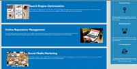

# 02-challenge

## Refactoring code to make it more accessible, clean up code, and fix errors. Motivation was to demistrate that the code can be made to work with less code. The problem it solves is to let individuals with screen readers able to view the page with ease. I learned how to troubleshoot code and do anchers inside code to sections of code. Also I learned how to consolidate multiple classes to a sigle css style 

## Table of Contents (Optional)

If your README is long, add a table of contents to make it easy for users to find what they need.

- [Installation](#installation)
- [Usage](#usage)
- [Credits](#credits)
- [License](#license)

## Installation

run the index.html file in a web browser

## Usage
https://jaberse09.github.io/02-Challenge-/ is the live website
From the home page links can be clicked to go to different sections 
link belows shows an example of link clicks The Website is broken down to different areas
Nav bar with 3 links 
    Search Engine Optimization
    Online Reputation Management
    Social Media Marketing 
Below is an image of people around a computer this is the hero image
Below that is 2 columns where on the left is 3 sections where the links go to
On the right is a side bar where keads, brand and cost information is
Then the footer is below both where is show s the made by and copyright information


https://drive.google.com/file/d/1tUO4NOwRLmo8_OpWjGlnZF2IKvRlkXxt/view

In the hero div it uses css to display an image.
Under the image is 3 rows and 2 columns through css.  

 ```md
    
    ```
    Image Displays the nav and hero image
 ```md
    
    ```
    Image Displays the sections
 ```md
    
    ```
    Image displays the footer

## Credits

Sajid Jaber


## License

Copyright (c) [2022] [Sajid Jaber]

Permission is hereby granted, free of charge, to any person obtaining a copy
of this software and associated documentation files (the "Software"), to deal
in the Software without restriction, including without limitation the rights
to use, copy, modify, merge, publish, distribute, sublicense, and/or sell
copies of the Software, and to permit persons to whom the Software is
furnished to do so, subject to the following conditions:

The above copyright notice and this permission notice shall be included in all
copies or substantial portions of the Software.

THE SOFTWARE IS PROVIDED "AS IS", WITHOUT WARRANTY OF ANY KIND, EXPRESS OR
IMPLIED, INCLUDING BUT NOT LIMITED TO THE WARRANTIES OF MERCHANTABILITY,
FITNESS FOR A PARTICULAR PURPOSE AND NONINFRINGEMENT. IN NO EVENT SHALL THE
AUTHORS OR COPYRIGHT HOLDERS BE LIABLE FOR ANY CLAIM, DAMAGES OR OTHER
LIABILITY, WHETHER IN AN ACTION OF CONTRACT, TORT OR OTHERWISE, ARISING FROM,
OUT OF OR IN CONNECTION WITH THE SOFTWARE OR THE USE OR OTHER DEALINGS IN THE
SOFTWARE.